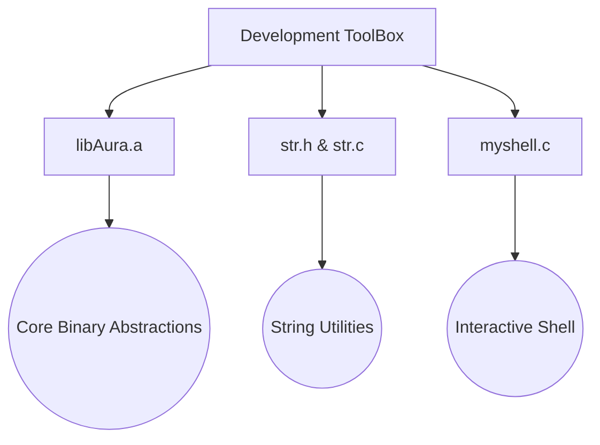

<div align="center">
  

  # ?? Development ToolBox

  **Your Swiss Army Knife for C Programming and System Utilities.**

  [](https://opensource.org/licenses/MIT)
  [](https://en.wikipedia.org/wiki/C99)
  
  ---
</div>

## ?? Introduction

The **Development ToolBox** is a robust collection of reusable C standard library practice modules, system interfaces, and core abstractions designed to accelerate bare-metal and embedded systems development.

Whether you're developing custom string manipulation libraries (`str.h`), interfacing with core shells (`myshell.c`), or linking against foundational static archives (`libAura.a`), this toolbox has you covered.

## ?? Repository Structure



## ??? Components

### 1. `libAura.a`
A pre-compiled static library containing optimized core utilities and runtime components. Essential for linking the AuraFS and other heavy-lifting file operations.

### 2. `str.c` & `str.h`
A comprehensive, safe, and efficient string manipulation suite written from scratch. Includes memory-safe string copy, concatenation, length calculation, and parsing functions.

### 3. `myshell.c`
A custom, interactive command-line interface mimicking standard Unix shells, tailored for direct interaction with custom file systems and hardware abstractions.

## ?? Getting Started

### Prerequisites
- GCC or any standard C compiler.
- Make (optional but recommended).

### Building

To compile a program using the string utilities and the shell:

```bash
gcc -o myshell myshell.c str.c -L. -lAura
```

## ?? License

This project is licensed under the MIT License - see the [LICENSE](LICENSE) file for details.
