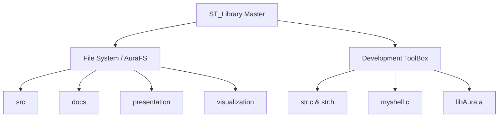

<div align="center">


# ?? ST_Library Master Repository

[](https://opensource.org/licenses/MIT)
[](https://en.wikipedia.org/wiki/C99)
[]()
[]()

Welcome to the **ST_Library**! This master repository hosts powerful custom solutions for embedded systems, high-performance computing, and bare-metal microcontroller operations. 

It is divided into two major interconnected projects: **AuraFS** and the **Development ToolBox**.

---
</div>

## ?? Repository Architecture



---

## 1?? File System (AuraFS) ??

**AuraFS** is a highly innovative, extent-based, multi-granularity zoned filesystem engineered specifically for embedded microcontrollers (like the STM32), edge IoT nodes, and high-performance storage simulations.

### ?? Key Features
- **Extent-Based Allocation:** Radically reduces fragmentation using continuous block sequences.
- **Zoned Architecture:** Multi-granularity zones for different sizes of data to minimize internal fragmentation.
- **Interactive Visualizer:** A stunning HTML-based visualizer for tracking allocation blocks.

### ?? How to Operate AuraFS

1. **Navigate to the Directory:**
   ```bash
   cd "File System/src"
   ```
2. **Compile the Core System & Shell:**
   ```bash
   make
   ```
   *(If you are compiling manually without Make, compile `myshell.c` alongside `userfs.c` and your core libraries)*
3. **Run the Interactive Shell:**
   ```bash
   ./myshell
   ```
   You will drop into the `AuraFS>` prompt where you can run commands like `format`, `mount`, `ls`, `touch`, `mkdir`, and `alloc_status`.
4. **View Presentations & Docs:**
   Check out the PDF documentation and markdown change logs inside `File System/presentation` for deep dives into the filesystem's architecture!

---

## 2?? Development ToolBox ??

The **Development ToolBox** is your Swiss Army Knife for C Programming. It contains robust, reusable C standard library implementations, static archives, and interactive shell wrappers needed to build everything from file systems to simple OS simulations.

### ?? Key Components
- **`libAura.a`**: A pre-compiled static library serving as the backbone for custom system calls and hardware abstractions.
- **`str.c` & `str.h`**: A fully custom, highly optimized, and memory-safe string manipulation library. Replaces standard `<string.h>` operations for secure bare-metal usage.
- **`myshell.c`**: A lightweight interactive shell environment that can be linked to your own projects for instant CLI capabilities.

### ?? How to Operate the ToolBox

1. **Navigate to the Directory:**
   ```bash
   cd Development_ToolBox
   ```
2. **Compile a Custom CLI App:**
   Link the interactive shell against the string utilities and the `libAura` static archive:
   ```bash
   gcc -o my_custom_shell myshell.c str.c -L. -lAura
   ```
3. **Execute:**
   ```bash
   ./my_custom_shell
   ```
4. **Integrate into Your Own Code:**
   Simply include `str.h` in your own C files and link them with `str.c` during your build step to utilize the memory-safe string APIs!

---

<div align="center">
  <i>Built with passion for embedded engineering.</i><br>
  <b>Team AURA</b>
</div>
